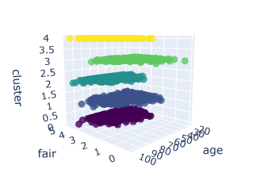
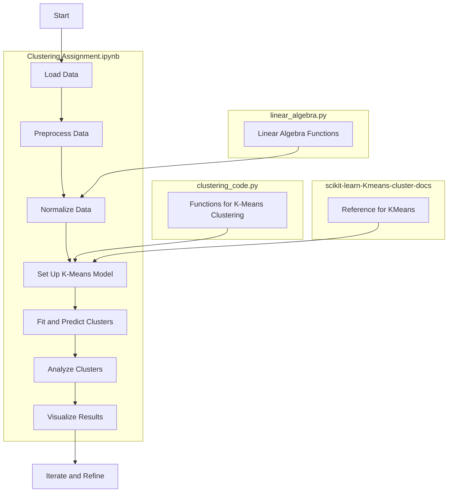

# Assignment Results

### Demographic Clustering

__I used four clusters, arbitrarily, for this analysis.__

__How evenly do your clusters align with the regions?__

None of my clusters appear to be confined to a single region. All clusters span multiple areas, suggesting that regional factors do not significantly influence age, gender, engagement, or account age.

Briefly describe the clusters. 

Cluster:
* Zero: Highly engaged only. Account age is between 0 and 30. User age is between 18 and 80. All genders. 
* One: All levels of engagement. Account age is between 10 and 50. User age is between 40 and 95. All genders.
* Two: Only engaged and not engaged. Account age is between 0 and 33. User age is between 18 and 85. Only males.
* Three: Only engaged and not engaged. Account age is between 0 and 33. User age is between 18 and 95. Only females and other.

I [used a cluster 'dashboard'](cluster_exploration_dashboard.ipynb) to explore the focal values of the clusters. It utilizes both 2-D and 3-D Dashboard to visualize the data by the different features. 

### Values Clustering
After you’ve built your clusters, report the following information on each cluster:

* Predominant region
* Average age and account age
* Most common focal value
* Mean results on the questions of `pub.greater.priv`, `experience.more.important`, and `teachers.underpaid`. 

Each of my clusters encompasses various regions; there is no single predominant region for any of the clusters. 

Most Common Focal Values:
* Zero: Environment
* One: Health (i.e. cancer research)
* Two: Health (i.e. cancer research)
* Three: Education                         
* Four: Education                         

## Workflow

## Feedback
Great work on this. I your write-up is thorough and engaging, as usual. It's interesting that we don't see much regional alignment. Typically I see a bit more of that. Regardless, great work. 

## ADA Clustering In-Class & Assignment

This repo holds the clustering code that we'll use in class and will
also be the place you put your clustering assignment. I have included
code that does clustering both in Python and R. 

This repo includes the following files: 

* `Clustering Assignment.ipynb`: This is the assignment for this week.
* `Clustering Surveys.ipynb`: We'll go through this code in class.
* `Clustering Surveys-Solutions.ipynb`: The solutions to the in-class work. 
* `cluster_exploration_dashboard.ipynb`: Dashboards for cluster exploration. Has 2-d and 3-d dashboards.
* `clustering_code.py`: Helper functions from "Data Science from Scratch" that
perform K-means clustering. 
* `linear_algebra.py`: More code from DSFS, which has the needed linear algebra
functions that we use. 
* `r-examples/`: A folder that holds R versions of all of this code. 
* `survey_responses.txt`: The results of annual class surveys, building up 
a data set to perform clustering on. I'll post an updated version to Moodle 
if more results come in. 
* `washington_survey_data.txt`: Data for the assignment.

